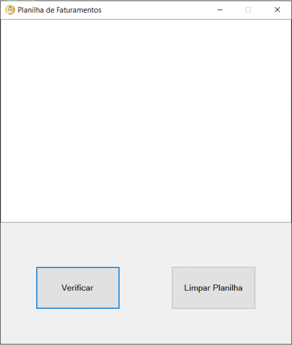

# Linguagem de Programação 2
Repositório para as atividades de LP2.  
Faculdade de Tecnologia de Sorocaba - Fatec SO.  
Professora: Denilce de Almeida Oliveira Veloso.  

 **Atividades** 

- [Calculadora](https://github.com/Edssaac/LP2/blob/main/Atividade%201)   

 

- [Pesômetro](https://github.com/Edssaac/LP2/blob/main/Atividade%202)   

 

- [Triângulando](https://github.com/Edssaac/LP2/blob/main/Atividade%203)   

 

- [Faixa de Desconto](https://github.com/Edssaac/LP2/blob/main/Atividade%204)   

 

- [Salários](https://github.com/Edssaac/LP2/blob/main/Atividade%205)   

 

- [Métodos](https://github.com/Edssaac/LP2/blob/main/Atividade%206)   

 

- [Métodos 2](https://github.com/Edssaac/LP2/blob/main/Atividade%207)   

 

- [InputBox](https://github.com/Edssaac/LP2/blob/main/Atividade%208)   

 

- [Projeto Final](https://github.com/Edssaac/LP2/blob/main/Projeto%20Final)   

 

- [Prova](https://github.com/Edssaac/LP2/blob/main/Prova)   

## Contato

